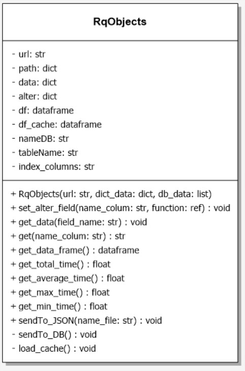

## Prueba Python - Emilton Mendoza Ojeda
---
# Descripción de la prueba


Desarrolle una aplicación en python que genere la tabla anterior teniendo las siguientes consideraciones:

- De https://restcountries.com/ obtenga el nombre del idioma que habla el país y encríptelo con SHA1
- En la columna Time ponga el tiempo que tardo en armar la fila (debe ser automático)
- La tabla debe ser creada en un DataFrame con la librería PANDAS
- Con funciones de la librería pandas muestre el tiempo total, el tiempo promedio, el tiempo mínimo y el máximo que tardo en procesar todas las filas de la tabla.
- Guarde el resultado en sqlite.
- Genere un Json de la tabla creada y guárdelo como data.json
- La prueba debe ser entregada en un repositorio git.

Es un plus si:

- No usa framework.
- Entrega Test Unitarios.
- Presenta un diseño de su solución.


---
# Otros Requerimientos
Además de los requerimientos propuestos en la prueba, la solución fue desarrollada de manera que pueda cumplir con los siguientes requisitos:  
- El código escrito en esta solución pueda ser aprovechado y ampliado en otras soluciones. 
- Con el fin de cumplir el requerimiento anterior se realizará aplicando la POO.
- Realizar la petición de datos a cualquier restapi que no solicite key y no solamente al api de restcountries, ejemplo:  
  https://pokeapi.co/api/v2/pokemon/  
  https://randomuser.me/api/  
  https://catfact.ninja/fact  
- Extraer cualquier cantidad de campos deseados del json **sin reescribir el código**.  
- Implementar una manera de modificar los datos de una columna de forma que no implique reescribir código, por ejemplo encriptar el lenguaje del país en SHA1.
- Aprovechar el almacenamiento del dataframe en la base de datos para evitar peticiones innecesarias al api, disminuyendo la carga de esta e incrementando la velocidad de respuesta de la solución.

---
# Paso a paso de la solución 
-	Cargo la configuración necesaria desde un archivo con formato json (.env) para la creación de un objeto encargado de ejecutar las peticiones guardar en la base de datos y crear el archivo data.json
-	Creo el objeto database (db) en cuyo constructor valido si la base de datos existía previamente. Si existe solo se envía un mensaje a consola diciendo que ya existe, en caso de que no, esta es creada con el nombre dado en el archivo de configuración (db_name)
-	Creo un diccionario a partir de las listas de nombre de las columnas (name_colums) que funcionaran como llaves y ruta del dato (path_data) que funcionara como valor, ambas listas se encuentran en el archivo de configuración (.env).  
Este diccionario será pasado como parámetro de nuestro objeto encargado de realizar las consultas (rq) para ser iterado, permitiendo así trabajar con una cantidad n de columnas sin tener que modificar el código, solo el archivo de configuración.  
Para lograr este objetivo utilizamos la librería **jmespath** que permite acceder a los valores de los archivos json a través de un string que contiene la ruta para llegar hasta este valor, ejemplo:  
> Si quisiera acceder a la región del país  
region=jmespath("[0].region",response.json())  
Si quisiera acceder al primer lenguaje del país  
primer_lenguaje=("[0].languages[0].name", response.json())  
el diccionario para resolver la situación planteada por el test tendría la siguiente estructura  
{'Region': '[0].region', 'Country': '[0].name', 'Language': '[0].languages[0].name'}  
-	Creo una lista con los datos necesarios para el acceso a la base de datos nombre de la base de datos, nombre de la tabla donde se guardará el dataframe, nombre de la columna que sirve como índice para la búsqueda en la base de datos esta misma columna es la que contiene los valores con los que se realizaron las peticiones al api. Estos valores están guardados en el archivo de configuración (.env) bajo el nombre db_name, table_name, index_column respectivamente.
-	Creo el objeto principal de consulta al api (rq) con la url de la api (url), el diccionario (data_request) y la lista (data_db) creada anteriormente como parámetros del constructor.  
-	En el constructor del objeto principal de consulta (rq) abrimos la tabla (table_name) de la base de datos (db_name) y cargamos su contenido en el data frame cache (__df_cache) este dataframe será consultado antes de hacer las peticiones al api, para evitar peticiones innecesarias a esta y ahorrando tiempos de proceso ya que la petición sería mucho más rápido en caso de que el data frame tenga la información que se requiere.
-	A través del método publico set_alter_field(“name_colum”,ref a function) del objeto principal de consulta(rq) establezco  que columnas (name_colum) del dataframe principal (__df) serán afectadas por la función (ref a function). Estos valores recibidos por la función son guardados en un diccionario (__alter).
En la creación de los rows para el dataframe principal (__df) se revisa si el nombre de la columna se encuentra en el dataframe de modificación (__alter) en caso de encontrarse, el valor original que correspondía a esta columna es enviado a la función que esta como valor en el diccionario de modificación(__alter) y es reemplazado por el valor que retorna la función, en caso de no encontrarse el nombre de la columna como llave en el diccionario de modificación(__alter) se almacena el valor original.  
Para hacer referencia a una función se coloca el nombre de la función sin las paréntesis ni argumentos.  
  
Ejemplo:  
```
#Función que recibe un valor y lo devuelve encriptado en SHA1  
def hash_SHA1(value):  
    return hashlib.sha1(value.encode('utf-8')).hexdigest()  
    . . .
#Los valores de la columna Language serán reemplazado por el valor que retorne la función hash_SHA1  
    rq.set_alter_field("Language", hash_SHA1)
```
-	Cargo el archivo json donde están guardados los datos a consultar en la api, este archivo esta indicado en (query_file) del archivo de configuración (.env)
-	Recorro los datos del archivo json (query_files) y los paso como parámetros al método get_data del objeto de consulta principal (rq)
-	Al llamar a la funcion get_data del objeto principal de consulta(rq):  
    -	Verifico si el campo esta guardado en el dataframe cache:  
        - Si:  
          - Envío mensaje a consola diciendo que existe en la cache  
          - Inicio el conteo del tiempo para saber cuánto tiempo demora en registrarse la fila al dataframe principal  
          - Agrego la fila encontrada en el dataframe cache al dataframe principal df  
          - Detengo el conteo del tiempo
          - Calculo el tiempo tardado en generar la nueva fila en el dataframe principal  
          - Actualizo el valor de la columna time por el nuevo valor calculado  
        - No:  
          - Envio mensaje diciendo que no existe en cache
          - Inicio el conteo del tiempo para saber cuánto tiempo demora en registrarse la fila al dataframe principal
          - Realizo la petición a la url:
            - Respuesta positiva:
              - Itero el diccionario path obteniendo los valores de la ruta json
              - Dentro de una excepción try intento alterar su valor con la función referenciada si funciona asigno el valor modificado a la columna correspondiente del dataframe original
              - En caso de no funcionar asigno el valor original a la columna correspondiente del dataframe principal
              - Detengo el conteo del tiempo
              - Calculo el tiempo tardado en generar la nueva fila en el dataframe principal
              - Actualizo el valor de la columna time por el nuevo valor calculado
              - Guardo la fila como registro en la base de datos
            - Respuesta negativa:
              - Envío mensaje a consola diciendo petición url fallida

-	Imprimo en consola el dataframe principal (_df) a través del método get_data_frame del objeto principal de consulta (rq)
-	Imprimo en consola el tiempo total de generación del dataframe a través del método get_total_time del objeto principal de consulta (rq)
-	Imprimo en consola el tiempo promedio de generación de las filas través del método get_average_time del objeto principal de consulta (rq)
-	Imprimo en consola el tiempo más alto de generación de las filas través del método get_max_time del objeto principal de consulta (rq)
-	Imprimo en consola el tiempo más corto de generación de las filas través del método get_min_time del objeto principal de consulta (rq)
-	Guardo el dataframe principal (__df) en formato json con del nombre de data.json a traves del método sendTo_JSON del objeto principal de consulta (rq)


---
# Descripción de clases
## clase RqObjects  
  
### Atributos
- **url**: privado de tipo string es utilizado para almacenar la url de la api a consultar ejemplos:  
“https://restcountries.com/v2/name/”  
”https://pokeapi.co/api/v2/pokemon/”  
- **path**: privado de tipo Diccionario(string, string) es utilizado para almacenar la ruta de los valores del json referenciados por una llave que es el nombre de la columna ejemplos:  
{“tipo”:” types[0].type.name”}  
{“continente”:” [0].region”}  
- **data**: privado de tipo Diccionario(string, string) se utiliza para almacenar los datos que serán necesarios para crear la nueva fila del dataframe,su longitud depende de las columnas que se quieran obtener de la peticion ejemplos:  
{“nombre”:”pikachu”,”tipo”:”Electric”…}  
{“Region”:”Americas”,”Country”:”Colombia”,” Language”:”Spanish”… }  
- **alter**: privado de tipo Diccionario(string, ref_function) se utiliza para almacenar los nombres de las columnas y la referencia a la función que va alterar esa columna ejemplo:  
{“tipo”:cambiar_tipo}  
{“Language”:hash_SHA1}  
- **df**: privado de tipo pandas dataframe, se utiliza para almacenar los valores extraidos de la peticion, también se utiliza para generar el archivo data.json Ejemplo:  
  
    |   | Region | Country | Language                                 | time  |
    |---|--------|---------|------------------------------------------|-------|
    | 0 | Africa | Angola  | 23882c575954a0789bf02aba9e6dd01f539bc738 | 0.000 |
    | 1 | Europe | Spain   | 8df7f1b361b2af42d36011e00d22c0f9891ec0b0 | 0.000 |

- **df_cache**: privado de tipo pandas dataframe, se utiliza para almacenar los valores extraídos de la base de datos utilizada como cache para evitar peticiones innecesarias al api, posee la misma estructura que el atributo df  
- **nameBD**: privado de tipo String contiene la ruta y el nombre de la base de datos donde será almacenado el dataframe principal df  
- **tableName**: privado de tipo String contiene el nombre de la tabla donde se almacenara el dataframe principal  
- **index_columns**: privado de tipo String  contiene el nombre de la columna mediante el cual se verificara si la peticion ya se encuentra en la base de datos  
### Métodos
- **__init__(Str,Dict,List)**: constructor de la clase RqObjects, recibe como parámetros la url de la api a consultar, un diccionario con los nombres de las columnas como llaves y las rutas a los valores del json como valores por ultimo recibe una lista que contiene la ruta y nombre de la base de datos, el nombre de la tabla donde se almacenara el dataframe principal y la columna que se utilizara para verificar si la petición ya se encuentra en la base de datos. se encarga de inicializar los atributos privados de la clase y cargar los datos almacenados en la base de datos en el atributo df_cache a través del método privado load_cache    
- **get_data(Str)**: recibe como parámetro el valor a requerir de la API, se encarga de buscar dicho parámetro primeramente en la base de datos cargada en dataframe cache y si no es encontrado realiza la petición al api almacena los resultados de la petición en el dataframe principal df y guarda en la base de datos
## Class Databases
   
### Atributos
- **path_name**: privado de tipo String contiene la ruta y el nombre de la base de datos donde será almacenado el dataframe principal df  
### Métodos  
- **__init__(Str)**: constructor de la clase, recibe la ruta completa donde se desea crear la base de datos, para luego crearla, si esta ya existe imprime un mensaje en consola y no realiza ninguna otra acción  
- **String get_path_name()**: retorna un String que contiene la ruta y el nombre de la base de datos donde será almacenado el dataframe principal df  
---  
# Configuración de la solución  
La solución puede ser configurada a través del archivo **.env** que tiene formato json con los siguientes campos: 

>{  
        **"url"**: "url de la apiRest",  
        **"name_columns"**: ["Label Columna 1","Label Columna 2",...,"Label Columna n"],  
        **"path_data"**: ["ruta del registro a extraer 1","ruta del registro a extraer 2",...,"ruta del registro a extraer n"],  
        **"db_name"**: "ruta y nombre de la base de datos",  
        **"table_name"**: "nombre de la tabla en la que se almacenara el dataframe",  
        **"index_column"**:"nombre de la columna por la cual se realizarán las búsquedas",  
        **"query_file"**:"ruta y nombre del archivo json que contiene las consultas a realizar en la api (peticiones)"  
        }  

Cabe señalar que el número valores contenidos en **name_columns** debe ser igual al número de valores contenidos en **path_data**.  
para dar solución a la prueba propuesta el archivo de configuración .env estaría configurado con los siguientes valores:
>{  
        **"url"**: "https://restcountries.com/v2/name/",  
        **"name_columns"**: ["Region","Country","Language"],  
        **"path_data"**: ["[0].region","[0].name","[0].languages[0].name"],  
        **"db_name"**: "db/cache.db",  
        **"table_name"**: "countries",  
        **"index_column"**:"Country",  
        **"query_file"**:"countries.json"  
        }  

El archivo de registros de consultas al api tiene el siguiente formato:  
>{**"query"**:[  
"peticion 1",  
"peticion 2",  
...  
"peticion n"  
]}

para dar solución a la prueba propuesta el archivo de consulta **countries.json** (nombre que se encuentra en .env.query_file) estaría configurado con los siguientes valores:

>{"query":[  
"Angola",  
"Spain",  
"France",  
"Germany",  
"Italy",  
"Mexico",  
"Colombia",  
"Argentina",  
]}  
  

---
# Ejecución de la solución
Mediante la terminal ubicarse en el directorio donde se encuentra el archivo main.py  
  

Instalar la libreria **virtualenv**
```virtualenv
pip install virtualenv
```  
Creamos el entorno virtual
```virtualenvcreate
virtualenv -p python3 venv
```  
Ejecutamos el entorno virtual
```virtualenvactivate
.\venv\Scripts\activate
```  
Instalamos las librerias necesarias para la ejecución de la prueba
```requirements
pip install -r .\requirements.txt
```  
Ejecutamos la prueba a través del script *main.py*
```main.py
python .\main.py
```

---

las salida de los datos será visualizada a través de la consola la base de datos y del fichero data.json
