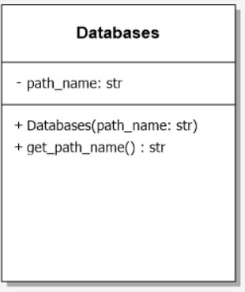

## Prueba Python - Emilton Mendoza Ojeda
---
# Descripción de la prueba


Desarrolle una aplicación en python que genere la tabla anterior teniendo las siguientes consideraciones:

- De https://restcountries.com/ obtenga el nombre del idioma que habla el país y encríptelo con SHA1
- En la columna Time ponga el tiempo que tardo en armar la fila (debe ser automático)
- La tabla debe ser creada en un DataFrame con la librería PANDAS
- Con funciones de la librería pandas muestre el tiempo total, el tiempo promedio, el tiempo mínimo y el máximo que tardo en procesar todas las filas de la tabla.
- Guarde el resultado en sqlite.
- Genere un Json de la tabla creada y guárdelo como data.json
- La prueba debe ser entregada en un repositorio git.

Es un plus si:

- No usa framework.
- Entrega Test Unitarios.
- Presenta un diseño de su solución.


---
# Otros Requerimientos
Además de los requerimientos propuestos en la prueba, la solución fue desarrollada de manera que pueda cumplir con los siguientes requisitos:  
- El código escrito en esta solución pueda ser aprovechado y ampliado en otras soluciones. 
- Con el fin de cumplir el requerimiento anterior se realizará aplicando la POO.
- Realizar la petición de datos a cualquier restapi que no solicite key y no solamente al api de restcountries, ejemplo:  
  https://pokeapi.co/api/v2/pokemon/  
  https://randomuser.me/api/  
  https://catfact.ninja/fact  
- Extraer cualquier cantidad de campos deseados del json **sin reescribir el código**.  
- Implementar una manera de modificar los datos de una columna de forma que no implique reescribir código, por ejemplo encriptar el lenguaje del país en SHA1.
- Aprovechar el almacenamiento del dataframe en la base de datos para evitar peticiones innecesarias al api, disminuyendo la carga de esta e incrementando la velocidad de respuesta de la solución.

---
# Paso a paso de la solución 
-	Cargo la configuración necesaria desde un archivo con formato json (.env) para la creación de un objeto encargado de ejecutar las peticiones guardar en la base de datos y crear el archivo data.json
-	Creo el objeto database (db) en cuyo constructor valido si la base de datos existía previamente. Si existe solo se envía un mensaje a consola diciendo que ya existe, en caso de que no, esta es creada con el nombre dado en el archivo de configuración (db_name)
-	Creo un diccionario a partir de las listas de nombre de las columnas (name_colums) que funcionaran como llaves y ruta del dato (path_data) que funcionara como valor, ambas listas se encuentran en el archivo de configuración (.env).  
Este diccionario será pasado como parámetro de nuestro objeto encargado de realizar las consultas (rq) para ser iterado, permitiendo así trabajar con una cantidad n de columnas sin tener que modificar el código, solo el archivo de configuración.  
Para lograr este objetivo utilizamos la librería **jmespath** que permite acceder a los valores de los archivos json a través de un string que contiene la ruta para llegar hasta este valor, ejemplo:  
> Si quisiera acceder a la región del país  
region=jmespath("[0].region",response.json())  
Si quisiera acceder al primer lenguaje del país  
primer_lenguaje=("[0].languages[0].name", response.json())  
el diccionario para resolver la situación planteada por el test tendría la siguiente estructura  
{'Region': '[0].region', 'Country': '[0].name', 'Language': '[0].languages[0].name'}  
-	Creo una lista con los datos necesarios para el acceso a la base de datos nombre de la base de datos, nombre de la tabla donde se guardará el dataframe, nombre de la columna que sirve como índice para la búsqueda en la base de datos esta misma columna es la que contiene los valores con los que se realizaron las peticiones al api. Estos valores están guardados en el archivo de configuración (.env) bajo el nombre db_name, table_name, index_column respectivamente.
-	Creo el objeto principal de consulta al api (rq) con la url de la api (url), el diccionario (data_request) y la lista (data_db) creada anteriormente como parámetros del constructor.  

---
# Descripción de clases
## clase RqObjects  
  
descripcion de atributos y metodos de la clase RqObjects
## clase RqObjects  
   
descripcion de atributos y metodos de la clase databases
---
# Configuración de la solución  
La solución puede ser configurada a través del archivo **.env** que tiene formato json con los siguientes campos: 

>{  
        **"url"**: "url de la apiRest",  
        **"name_columns"**: ["Label Columna 1","Label Columna 2",...,"Label Columna n"],  
        **"path_data"**: ["ruta del registro a extraer 1","ruta del registro a extraer 2",...,"ruta del registro a extraer n"],  
        **"db_name"**: "ruta y nombre de la base de datos",  
        **"table_name"**: "nombre de la tabla en la que se almacenara el dataframe",  
        **"index_column"**:"nombre de la columna por la cual se realizarán las búsquedas",  
        **"query_file"**:"ruta y nombre del archivo json que contiene las consultas a realizar en la api (peticiones)"  
        }  

Cabe señalar que el número valores contenidos en **name_columns** debe ser igual al número de valores contenidos en **path_data**.  
para dar solución a la prueba propuesta el archivo de configuración .env estaría configurado con los siguientes valores:
>{  
        **"url"**: "https://restcountries.com/v2/name/",  
        **"name_columns"**: ["Region","Country","Language"],  
        **"path_data"**: ["[0].region","[0].name","[0].languages[0].name"],  
        **"db_name"**: "db/cache.db",  
        **"table_name"**: "countries",  
        **"index_column"**:"Country",  
        **"query_file"**:"countries.json"  
        }  

El archivo de registros de consultas al api tiene el siguiente formato:  
>{**"query"**:[  
"peticion 1",  
"peticion 2",  
...  
"peticion n"  
]}

para dar solución a la prueba propuesta el archivo de consulta **countries.json** (nombre que se encuentra en .env.query_file) estaría configurado con los siguientes valores:

>{"query":[  
"Angola",  
"Spain",  
"France",  
"Germany",  
"Italy",  
"Mexico",  
"Colombia",  
"Argentina",  
]}  
  

---
# Ejecución de la solución
Mediante la terminal ubicarse en el directorio donde se encuentra el archivo main.py  
  

Instalar la libreria **virtualenv**
```virtualenv
pip install virtualenv
```  
Creamos el entorno virtual
```virtualenvcreate
virtualenv -p python3 venv
```  
Ejecutamos el entorno virtual
```virtualenvactivate
.\venv\Scripts\activate
```  
Instalamos las librerias necesarias para la ejecución de la prueba
```requirements
pip install -r .\requirements.txt
```  
Ejecutamos la prueba a través del script *main.py*
```main.py
python .\main.py
```

---

las salida de los datos será visualizada a través de la consola la base de datos y del fichero data.json
